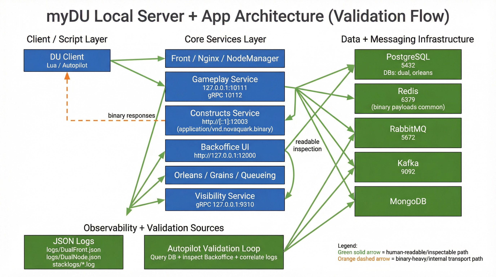
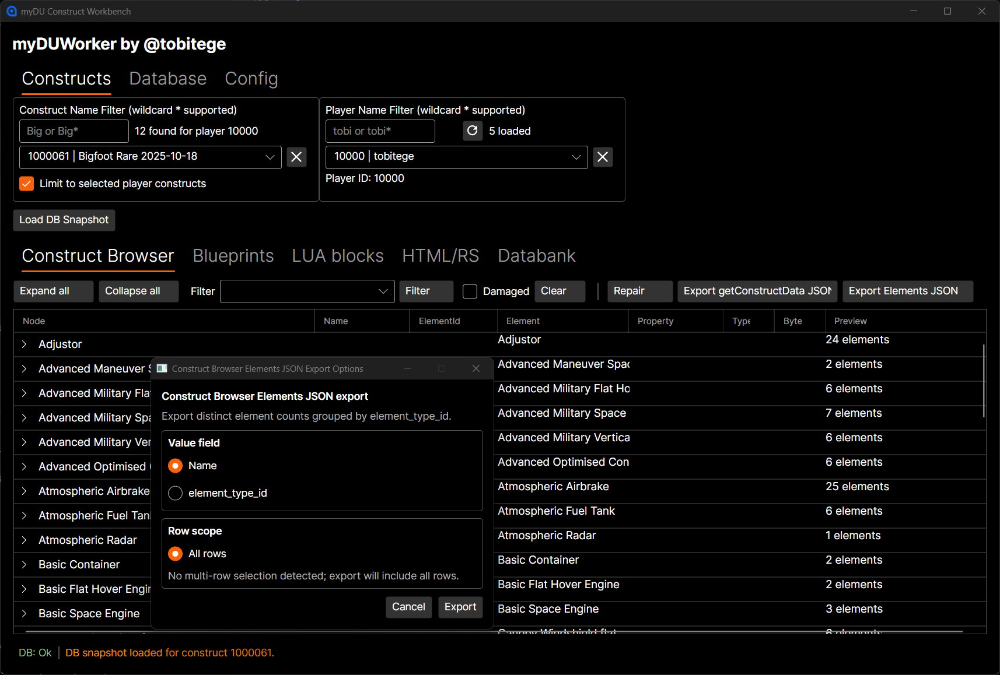
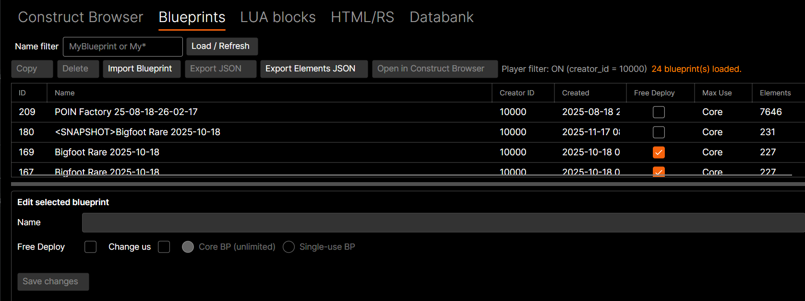
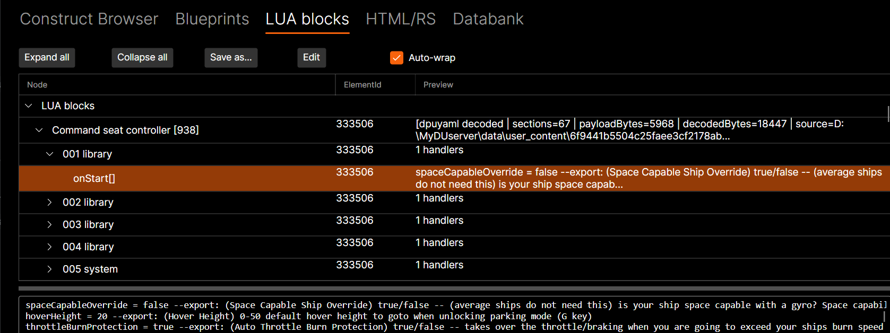
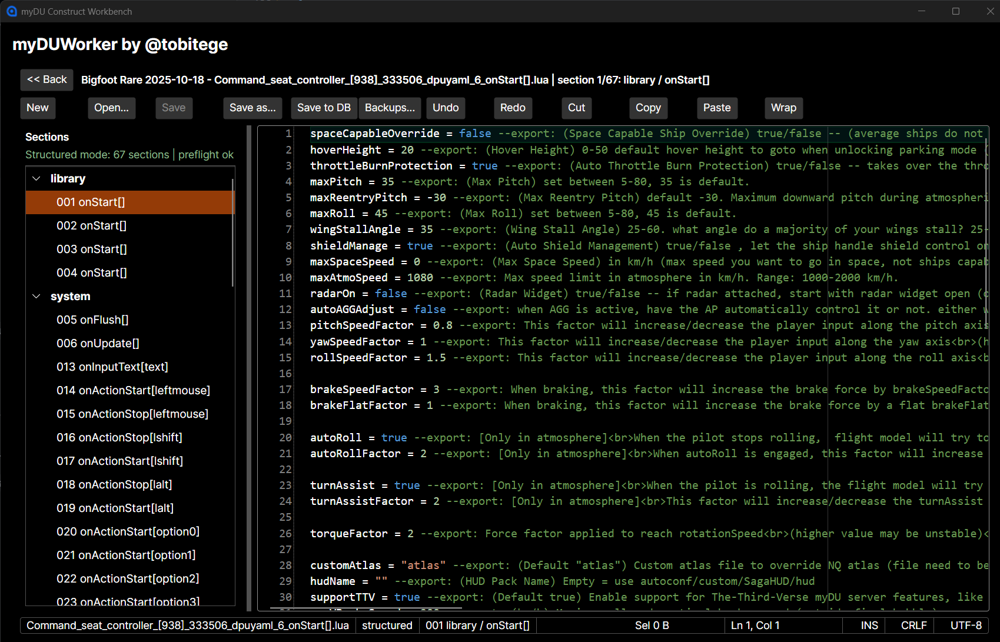
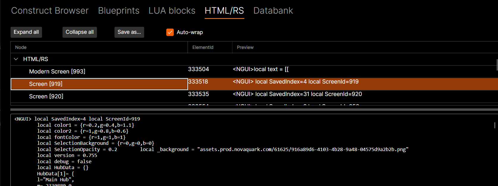
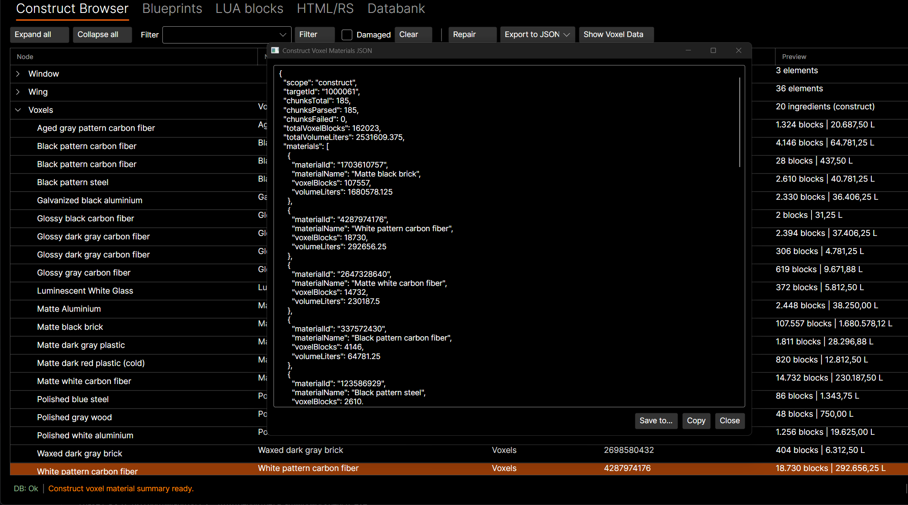

# myDUWorkbench

`myDUWorkbench` is an open-source desktop tool built with **C#**, **.NET 9**, and **Avalonia UI**.

Its job is simple: pull live construct data from your local myDU environment, decode what it can, and give you clear output you can use for script/autopilot validation.

<p align="center">
  <a href="https://github.com/tobitege"></a>
  <a href="https://x.com/tobitege"></a>
  <a href="./LICENSE"></a>
</p>

<p align="center">
  
</p>

## Features

- **Real-Time Data Snapshots**: Instantly view live information about your constructs, players, and elements directly from the database, neatly decoded for easy reading.
- **Built-in Lua Editor**: Load and view your Lua code directly in the app from ingame constructs or blueprints.
- **Safe Database Saves**: Lua scripts can be edited and saved back to the database with built-in safety checks to prevent data loss.
- **Automatic Lua Backups**: Keep your work safe with automatic local backups, complete with restore features and a side-by-side comparison tool.
- **Data Exporting Made Simple**: Generate clean, ready-to-use JSON snapshots of your construct data for external simulators and tools.  
  Export selected elements as JSON file for 3rd party tools, like DU-Industry-Tool.
- **Blueprint Management**: Browse, inspect, and import your blueprint files. Our import tools handle backend quirks to allow import of large files that error in official backend.
- **Flight & Physics Telemetry**: Separate Python TUI apps to log live exact position, rotation, velocity, and mass data in logfiles. Requires separate FlightLogger mod!

## Why This Exists

The myDU stack exposes useful runtime data, but a lot of it is spread across DB tables and binary service payloads.

This app gives you one place to:

- verify what your current pilot/construct state looks like
- compare DB values vs endpoint values
- generate a clean JSON snapshot for downstream scripts/simulators

## User Interface

<p align="center">
  List of all/filtered constructs in game<br>
  <br>
  List of all/filtered Blueprints in game<br>
  
</p>

<p align="center">
  LUA blocks of all elements<br>
  <br>
  LUA editor<br>
  <br>
  RenderScript/HTML content (screens, signs)<br>
  
</p>

<p align="center">
  Voxel (materials) export with names and total volumes<br>
  <br>
</p>

---

## Tech Stack

- **UI:** Avalonia UI 11 (Axaml)
- **Runtime:** .NET 9
- **Language:** C#
- **DB access:** `Npgsql`
- **MVVM:** `CommunityToolkit.Mvvm`

---

## Prerequisites

Before running the app, make sure:

1. Your myDU stack is running
2. PostgreSQL is reachable (default: `127.0.0.1:5432`)
3. Construct endpoint is reachable (commonly IPv6, e.g. `http://[::1]:12003/...`)
4. You know at least one of:
   - `Construct ID`
   - `Player ID` (that maps to `player.construct_id`)

Typical defaults from your setup:

- DB host: `127.0.0.1`
- DB port: `5432`
- DB name: `dual`
- DB user: `dual`
- DB password: `dual`
- Server root path: `C:\MyDUserver`
- Endpoint template: `http://[::1]:12003/constructs/{id}/info`

Important:

- You must manually set `Server Root Path` once to the location of your local myDU server installation before using DB-backed Lua/hash decoding features.

---

## Build and Run

Adapt paths to your local folders; from a terminal:

```powershell
dotnet restore "C:\github\myDUWorkbench\MyDu.csproj"
dotnet build "C:\github\myDUWorkbench\MyDu.csproj"
dotnet run --project "C:\github\myDUWorkbench\MyDu.csproj"
```

Or use Visual Studio 2022/2026.

---

## UI Walkthrough

The application window is organized around three main tabs at the top level: **Constructs**, **Database**, and **Config**. Each of these contains its own set of features, often with nested sub-tabs and toolbar buttons for specific actions like filtering, exporting, or editing data. A persistent status bar along the bottom of the window shows the database connection state, operation progress, and context-sensitive information such as grid row counts.

### Constructs Tab

The Constructs tab is where you spend most of your time working with live construct data. At the top of this tab, two filter panels let you narrow down what you are looking at:

- **Construct Name Filter**: Type a construct name (or use wildcards like `Big*`) and press Enter to search. Matching constructs appear in a dropdown from which you select one to load. A checkbox lets you limit results to constructs owned by the currently selected player.
- **Player Name Filter**: Similarly, type a player name (wildcards supported) to find and select a player. The selected player's ID is displayed, and their active construct can be resolved automatically. A refresh button reloads the player list from the database.

Below the filters, five nested sub-tabs give you different views of the loaded construct's data:

#### Construct Browser

This is the primary data inspection view. After loading a construct, its elements and their decoded properties are displayed in a hierarchical, sortable data grid. Each row shows the node label, element name, element ID, element type, property name, property type, byte size, and a decoded value preview.

The toolbar provides:

- **Expand all / Collapse all**: Quickly open or close the entire tree hierarchy.
- **Filter**: A wildcard-capable text filter (with input history) that narrows the grid to matching element types or names. A **Damaged** checkbox further restricts the view to only damaged elements, and a **Clear** button resets filter state.
- **Repair**: Triggers a repair operation on destroyed elements for the loaded construct; progress is shown in the status bar.
- **Export to JSON**: A dropdown menu that lets you export the current construct data to a JSON file—either just the elements, just the voxel materials, or both.
- **Show Voxel Data**: Opens the voxel data view for the currently loaded construct.

#### Blueprints

This sub-tab lets you browse, inspect, edit, and import blueprints stored in the game database.

The top section provides a **name filter** (wildcards supported) and a **Load / Refresh** button to query blueprints from the database. Results appear in a sortable data grid showing each blueprint's ID, name, creator, creation date, free-deploy flag, max-use type, and element count.

The toolbar offers several actions for the selected blueprint:

- **Copy / Delete**: Duplicate or remove the selected blueprint in the database.
- **Import Blueprint**: Import a blueprint from a local JSON file into the game database. The app includes custom fallback logic that automatically handles large files which would otherwise cause the official backend to crash during voxel import.
- **Export JSON**: Save the selected blueprint's full JSON payload to a local file.
- **Export to JSON**: A dropdown with options to export element summaries, voxel materials, or both to a JSON file for use with third-party tools.
- **Show Voxel Data**: View the voxel data associated with the selected blueprint.
- **Open in Construct Browser**: Load the selected blueprint's elements and properties into the Construct Browser sub-tab for detailed inspection.

Below the grid, an **edit panel** lets you modify the selected blueprint's name, toggle its free-deploy flag, and change its usage type between core (unlimited) and single-use blueprints. Changes are persisted via the **Save changes** button.

#### LUA Blocks

This sub-tab shows the decoded Lua scripts (`dpuyaml_6` content) attached to the elements of the loaded construct. The scripts are presented in a hierarchical data grid organized by element and code section, with a read-only preview pane below that displays the full content of the selected Lua block.

Toolbar buttons:

- **Expand all / Collapse all**: Open or close the tree hierarchy.
- **Save as...**: Export the currently selected Lua block to a local file.
- **Edit**: Opens the selected Lua block in the built-in Lua Editor (described further below) for in-place editing with full save-to-database capability.
- **Auto-wrap**: Toggles word wrapping in the preview pane.

#### HTML/RS

This sub-tab is dedicated to Render Script content—the HTML and SVG code used to drive in-game screen units. Like the LUA Blocks tab, it presents a hierarchical data grid of decoded content with a preview pane below. Selecting an entry shows the full HTML/SVG source code.

Toolbar buttons:

- **Expand all / Collapse all**: Open or close the tree hierarchy.
- **Save as...**: Export the selected render script content to a local file.
- **Auto-wrap**: Toggles word wrapping in the preview pane.

#### Databank

This sub-tab shows Databank element contents attached to the loaded construct. The hierarchical data grid includes an additional **Kind** column that indicates the type of each databank entry, alongside the usual node label, element ID, and value preview. A preview pane below shows the full decoded content of the selected entry.

Toolbar buttons:

- **Expand all / Collapse all**: Open or close the tree hierarchy.
- **Save as...**: Export the selected databank content to a local file.
- **Auto-wrap**: Toggles word wrapping in the preview pane.

### Database Tab

The Database tab is where you configure and manage the connection to your local myDU PostgreSQL database. This is a one-time setup step that must be completed before the app can retrieve any live data.

The top section presents input fields for all connection parameters: **DB Host**, **DB Port**, **DB Name**, **DB User**, **DB Password**, **Property Limit** (controlling how many element properties are loaded per element), and **Server Root Path** (pointing to your local myDU server installation, required for hash-backed Lua and content decoding). A **Connect now** button establishes the database connection.

Below the connection settings, two nested sub-tabs provide additional functionality:

#### Database Summary

A read-only text area that shows a summary of the loaded construct and player data, including decoded highlights like mass and velocity values pulled from the database snapshot.

#### Endpoint

This sub-tab lets you probe the myDU construct service endpoint directly. You configure the **Endpoint Template** (which must contain an `{id}` placeholder for the construct ID), then press **Probe Endpoint Binary** to fetch and decode the binary response. The results are shown in two areas:

- **Endpoint Summary**: HTTP status, content type, and decode result details (whether the response was successfully decoded as a `ConstructUpdate`, fell back to a blob-header decode, or remained raw).
- **Endpoint Raw Preview**: The raw response content displayed as text or hex for manual inspection.

### Config Tab

The Config tab holds application-wide settings and preferences that persist across sessions:

- **Auto-load on startup**: Automatically load the last-used construct when the application starts.
- **Auto-connect database when offline**: Automatically attempt to reconnect to the database if the connection drops, with a configurable **retry interval** in seconds.
- **Auto-wrap content panes**: Enable word wrapping in all content preview areas by default.
- **Auto-collapse to 1st level**: Automatically collapse hierarchical data grids to just the first level after loading data.
- **LUA versioning backups**: Enable automatic local backup snapshots every time you save in the Lua Editor.
- **Auto-load player names**: Automatically query and cache player names from the database when the app connects.
- **Element properties listed by default**: A configurable filter grid that controls which element property types appear in the Construct Browser. Bulk **All** and **None** buttons let you quickly toggle visibility of all property types.
- **NQutils.dll path**: Optional override for the path to the NQ utilities assembly, used for certain decoding operations.
- **Blueprint import endpoint**: Optional override for the blueprint import service URL, useful if your local setup uses a non-standard port or address.

### Lua Editor

The Lua Editor is a dedicated editing view that replaces the main workbench when you click **Edit** on a Lua block. It provides a full-featured code editing experience built on AvaloniaEdit with syntax highlighting and line numbers.

The toolbar includes: **Back** (return to the main workbench), **New**, **Open**, **Save**, **Save as...**, **Save to DB**, **Backups...**, **Undo**, **Redo**, **Cut**, **Copy**, **Paste**, and a **Wrap** toggle for word wrapping.

When editing structured `dpuyaml` content, a **Sections** pane appears on the left side showing the hierarchical structure of the Lua code (handlers, methods, events). Clicking a section navigates the editor to that part of the code. The main editor area on the right supports monospaced editing with scrollbars and standard keyboard shortcuts.

A status bar at the bottom of the editor displays: the current source file or DB origin, the editing mode (plain or structured), the active section name, selection size in bytes, caret position (line and column), insert/overwrite mode, line ending type, and file encoding.

### Status Bar

A persistent status bar runs along the bottom of the main window and provides at-a-glance information:

- **DB status**: Shows the current database connection state (e.g. `Ok` or `Offline`).
- **Status message**: Displays the result of the most recent operation. For blueprint imports, this text is clickable and opens a detailed results dialog.
- **Grid entry count**: Shows how many rows are displayed in the active data grid.
- **Progress indicators**: Contextual progress bars appear during long-running operations such as element repair, blueprint import, or data export.

---

## Data Sources and Decode Rules

### Database

The app reads:

- `player` for active construct mapping
- `construct` for position/rotation
- `element_property` joined with `element` for construct-scoped properties

For `element_property.value`, decoding depends on `property_type`:

- `1` -> bool
- `2` -> integer
- `3` -> float/double
- `4` -> string
- `5` -> quat
- `6` -> vec3
- `7` -> hash/string

If a value is not clean text, it is shown as base64.
For `dpuyaml_*`, the app ports the Python decoder logic and tries:

1. Read DB value
2. If DB value is a 64-char hash, load `data/user_content/<hash>` under server root
3. Decode LZ4 block payload (`4-byte uncompressed-size header`)
4. Parse JSON and extract Lua from handlers/methods/events

### DB Endpoint

Endpoint responses are fetched as bytes and decoded as:

1. `ConstructUpdate` (preferred)
2. NQ blob header (fallback)
3. raw preview only (if decode fails)

---

## LUA Editor, Backups, and Save-to-DB

The `LUA blocks` tab includes an in-window editor workflow for `dpuyaml_6` content:

- `Edit` opens selected LUA block/part in a dedicated editor page.
- `<< Back` returns to the main workbench view.
- Editor toolbar includes `New`, `Open`, `Save`, `Save as...`, `Backups...`, and `Save to DB`.

### File Save Behavior

- `Save` writes to the current file path only.
- `Save` is disabled until content has been loaded from disk or previously saved via `Save as...`.
- `Save as...` writes UTF-8 (without BOM) local files.

### LUA Versioning Backups

In `Config`, enable `LUA versioning backups` to auto-create local backup snapshots on each editor save.

- Backup location: `%LOCALAPPDATA%\MyDu\LuaBackups`
- Backup files include metadata in filename/header when available:
  - element id
  - element/display/node/property context
  - source file/db source reference
  - content hash
- `Backups...` opens a manager dialog with:
  - list/refresh
  - delete selected / delete all
  - load selected backup into editor
  - side-by-side current-vs-backup text view

### Save to DB Mechanics

`Save to DB` is available for DB-origin `dpuyaml_6` editor sessions when DB status is `Ok`.

Current safety model:

1. Transactional row lock (`SELECT ... FOR UPDATE`)
2. Optimistic concurrency check against originally loaded raw DB bytes
3. Decode current dpuyaml payload (LZ4+JSON), patch edited LUA sections back into JSON
4. Re-encode payload
   - inline write for inline values
   - hash-backed write to `data/user_content/<sha256>` for hash values
5. Decode verification before final `UPDATE` + `COMMIT`

Important caveat:

- DB and filesystem writes are separate systems. The operation is DB-transaction-safe, but not physically atomic across DB + file storage. In rare failure windows, orphan hash files can remain.

---

## Known Limits

- Binary payloads can vary by service/version; decode may fail for unknown formats
- Endpoint might be IPv6-only (`[::1]`) even if IPv4 localhost fails
- Not all DB property blobs are human-readable
- This is a diagnostics/export tool, not a full protocol implementation

---

## Voxel Volume Calculation (Offline + Endpoint)

Voxel material volumes now have a documented priority order:

1. **Server metadata endpoint** (`voxel_metadata_endpoint`)
   - Uses `/voxels/<kind>/<id>/metadata` when reachable.
   - This is the most direct runtime source.
2. **Offline meta-blob decode** (`meta_blob_offline`)
   - No API required.
   - Reads each cell `records.meta.data` payload, decodes per-material quantities, and aggregates **leaf cells only** to avoid octree double-counting.
   - Quantity unit conversion: `quantity / 2^24` -> m^3, then m^3 * 1000 -> liters.
3. **Decoded estimate fallback** (`decoded_estimate`)
   - Uses voxel run counts (`voxel_blocks * 15.625 L`) only when neither metadata source is available.

### What Users See in Voxel Analysis Dialog

- Header now shows **Honeycomb (calculated)** and **Method**.
- `Method` text is user-facing:
  - `Blueprint meta data (offline)` -> offline decode from `meta` blobs.
  - `Server metadata endpoint` -> live `/metadata` endpoint.
  - `Voxel estimate (fallback)` -> legacy estimate fallback.

### `meta` Rows vs `voxel` Rows

- `meta` rows are **cell metadata blocks**. They contain material-volume metadata used for reliable honeycomb totals.
- `voxel` rows are geometry/material run payloads (`VoxelCellData`) used for structure/consistency diagnostics.
- Seeing both row types per cell is expected.

---

## Blueprint Coordinate Semantics (Voxel Space)

For blueprint voxel analysis in this repo, use these rules:

- `Model.JsonProperties.voxelGeometry.size` is interpreted as **half-extent in voxels** from center.
- Center-origin voxel range per axis is therefore `[-size, +size]`.
- Example (`MyShip.json`):
  - `size = 64` means valid construct voxel axis range is `-64..+64`.
  - This matches in-game voxel coordinate readout at hull edges.
- Voxel density conversion: `4 voxels = 1 meter`.
  - So `size=64` => meter range `-16..+16`.
  - `size=256` => meter range `-64..+64`.

Important distinction:

- `Model.Bounds` is **not** treated as a hard in-game construct limit in this tool.
- `Model.Bounds` values are metadata (occupied geometry AABB in blueprint-local storage frame), and are not used for reject/accept decisions.

---

## Blueprint Import Findings (NQ Backend Quirks)

These findings are based on real imports against local myDU/NQ services and are intentionally documented here, even when behavior is caused by backend bugs.

### 1) Endpoint expectations

- Game DB blueprint import endpoint is on gameplay service (`:10111`) at:
  - `POST /blueprint/import?creatorPlayerId=<id>&creatorOrganizationId=<id>`
- Construct service (`:12003`) does not host this route and returns `404` for `/blueprint/import`.
- Request body format must be JSON string containing base64 of raw blueprint JSON bytes (`[FromBody] byte[]` on backend side).

### 2) Blueprint ID handling

- A `0` blueprint id is treated as invalid/unknown in this app.
- Successful binary responses from backend are decoded from varint payloads (e.g. `decodedId=187`).

### 3) Schema mismatch in `elements[*].serverProperties`

- Some exported blueprint JSON files store `serverProperties` as an array.
- NQ preflight expects a dictionary/object map there.
- Import path applies runtime normalization for these known mismatches before POST.

### 4) Large blueprint crash/reset pattern

- Symptom:
  - backend connection closes (`socket 10054`) during import
  - Grains logs show `will import on <id>` then process restart / no clean response
- Root cause observed:
  - failure occurs in voxel import phase for some payloads.

### 5) Implemented fallback in this tool

- If import fails with crash-pattern transport errors, app retries once with:
  - top-level `VoxelData` stripped
- Request notes explicitly state fallback usage, for example:
  - `Fallback applied: stripped top-level VoxelData (...) after backend voxel import failure.`
- After a successful fallback import (with top-level `VoxelData` stripped), app now attempts voxel restoration by:
  - extracting original `VoxelData` cells from source payload
  - retargeting each cell `oid` to imported blueprint id
  - posting cells to voxel service `POST /voxels/jsonImport?kind=blueprints&ids=<importedId>&clear=1`
  - verifying with `/voxels/blueprints/<importedId>/dump.json` cell count

### 6) Operational meaning of fallback imports

- Stripped-voxel fallback is still a resilience step, but is no longer the end-state when voxel backfill succeeds.
- If voxel backfill fails, import remains metadata/elements-oriented and request notes include explicit warning.
- Use request notes/details dialog to confirm whether voxel backfill verification succeeded.

### 7) Methods involved (debug map)

App-side entry flow:

- `src/ViewModels/MainWindowViewModel.cs` -> `ImportBlueprintFileAsync(...)`
- `src/ViewModels/MainWindowViewModel.cs` -> `ImportBlueprintCoreAsync(...)`

App-side import service flow:

- `src/Services/MyDuDataService.cs` -> `ImportBlueprintFileIntoGameDatabaseAsync(...)`
- `src/Services/MyDuDataService.cs` -> `ImportBlueprintPayloadToGameDatabaseAsync(...)`
- `src/Services/MyDuDataService.cs` -> `SendBlueprintImportRequestAsync(...)`
- `src/Services/MyDuDataService.cs` -> `SendBlueprintImportRequestCoreAsync(...)`
- `src/Services/MyDuDataService.cs` -> `BuildBlueprintImportEndpointCandidates(...)`
- `src/Services/MyDuDataService.cs` -> `BuildBlueprintImportRequest(...)`
- `src/Services/MyDuDataService.cs` -> `TryParseBlueprintIdFromImportResponse(...)`

App-side payload normalization/fallback:

- `src/Services/MyDuDataService.cs` -> `PrepareBlueprintPayloadForGameDatabaseImport(...)`
- `src/Services/MyDuDataService.cs` -> `NormalizeElementServerPropertiesField(...)`
- `src/Services/MyDuDataService.cs` -> `TryBuildNoVoxelDataFallbackPayload(...)`
- `src/Services/MyDuDataService.cs` -> `TryBackfillVoxelDataAfterNoVoxelImportAsync(...)`
- `src/Services/MyDuDataService.cs` -> `BackfillVoxelDataViaVoxelServiceAsync(...)`
- `src/Services/MyDuDataService.cs` -> `TryBuildVoxelServiceImportPayload(...)`
- `src/Services/MyDuDataService.cs` -> `VerifyVoxelBlueprintDumpCellCountAsync(...)`

NQ backend call chain (from local source checkouts):

- `C:/github/NQ.Grains/Grains/NQ/Client/Controllers/BlueprintController.cs` -> `Import([FromBody] byte[] jsondata, ...)`
- `C:/github/NQ.Grains/Grains/NQ/Grains/Gameplay/BlueprintGrain.cs` -> `Import(BlueprintData blueprint, bool forceId)`
- `C:/github/NQ.Backend/NQ.Backend/Backend/Database/BlueprintSqlExtension.cs` -> `AddBlueprint(...)`
- `C:/github/NQ.Backend/NQ.Backend/Backend/Voxels/VoxelService.cs` -> `ImportFixture(...)`

---

## Voxel Persistence Findings (SQL vs Voxel Service)

These findings are from live checks against local `dual` + `orleans` Postgres DBs, local gameplay service, and local voxel service.

### 1) Voxel cells are not stored in PostgreSQL blueprint/construct tables

- In `dual`, voxel-related base tables by name are not present (`%voxel%` table scan found none).
- In `orleans`, no construct/blueprint voxel cell tables are present either.
- `construct.pipeline` / `construct.binary_pipeline` are not the main voxel cell store for tested rows.
- `blueprint.json_properties.voxelGeometry` stores metadata (e.g. `kind`, `size`, `voxelLod0`), not the full voxel cell payload.

### 2) Voxel payload is served by voxel service and keyed by object id

- Local config points to voxel service:
  - `C:/MyDUserver/config/dual.yaml`:
    - `http.voxel_service: http://127.0.0.1:8081`
    - `voxel.db[].uri: mongodb://.../dev_du...`
- Backend import path writes voxel data via voxel service:
  - `BlueprintGrain.Import(...)` -> `voxelService.ImportFixture(...)`
  - `VoxelService.ImportFixture(...)` -> `POST /voxels/jsonImport?kind=...&ids=...&clear=...`
- Practical key model:
  - SQL `blueprint.id` or `construct.id` is used as voxel object id (`oid`) in voxel service payload.

### 3) Live environment evidence pattern

- A construct and its related blueprint/snapshot blueprint were checked through voxel service dump endpoints.
- Equivalent construct/blueprint voxel objects returned matching cell counts for full-fidelity cases.
- Probe-created minimal blueprints (core + limited voxel cells) returned correspondingly small cell sets.
- Voxel cell documents include binary payload records such as:
  - `records.meta.data` and `records.voxel.data` (`$binary`)
  - plus indexing/coordinate fields (`x`, `y`, `z`, `h`, `k`, `oid`).

### 4) Consequence for custom voxel inserts

- Direct SQL inserts/updates into `blueprint`/`construct` tables are not enough to materialize voxels.
- To add/replace voxel blobs for a blueprint/construct id, data must go through voxel service import (`/voxels/jsonImport`) or an equivalent backend path that calls it.
- SQL remains necessary for blueprint metadata/elements/links consistency, but voxel geometry/content persistence is handled by voxel service storage.

### 5) Recommended safe workflow for experiments

1. Import/create blueprint metadata + minimal valid element graph (core at minimum) in game DB.
2. Import voxel cells for the same target id via voxel service (`kind=blueprints`).
3. Verify with `/voxels/blueprints/{id}/dump.json` and `/metadata`.
4. Only then test deploy/construct creation paths.

---

## Troubleshooting

### DB load fails

- Verify postgres is up
- Verify credentials and DB name
- Check firewall/local port usage

### Endpoint probe fails

- Try IPv6 loopback in endpoint template
- Confirm construct service port and route
- Check service logs

### Empty or weird property values

- Increase property limit
- Some values are binary by design
- Use endpoint + DB together for best coverage

---

### Backend call methods

Direct backend I/O methods:

- `_run_sql(...)`
  - Executes PostgreSQL calls through `psql` and returns parsed rows.
- `_router_post(...)`
  - Executes HTTP POST calls to game Router endpoints (for join/send chat flows).

Methods that trigger backend calls as part of normal flow:

- `_refresh_player_channel_options(...)` (reads player/org/construct context from DB)
- `_load_recent_messages(...)` (loads initial chat history from DB)
- `_poll_new_messages(...)` (polls incremental chat messages from DB)
- `_sync_missing_messages_to_log(...)` (backfills missed DB messages into log file)
- `_resolve_sender_id(...)` (player lookup in DB)
- `_send_message(...)` (resolves context and sends via Router join/send flow)

---

## Security Notes

- DB password is entered in UI and used at runtime only
- Do not commit real credentials if you later add config files
- Treat exported JSON as runtime telemetry data (may include sensitive operational details)

---

## Project Structure

- `Views/` - Avalonia windows (`MainWindow.axaml`)
- `ViewModels/` - MVVM logic and commands
- `Services/` - DB + endpoint access (`MyDuDataService`)
- `Models/` - binary decoder + telemetry models
